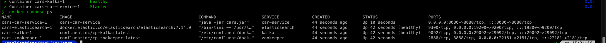
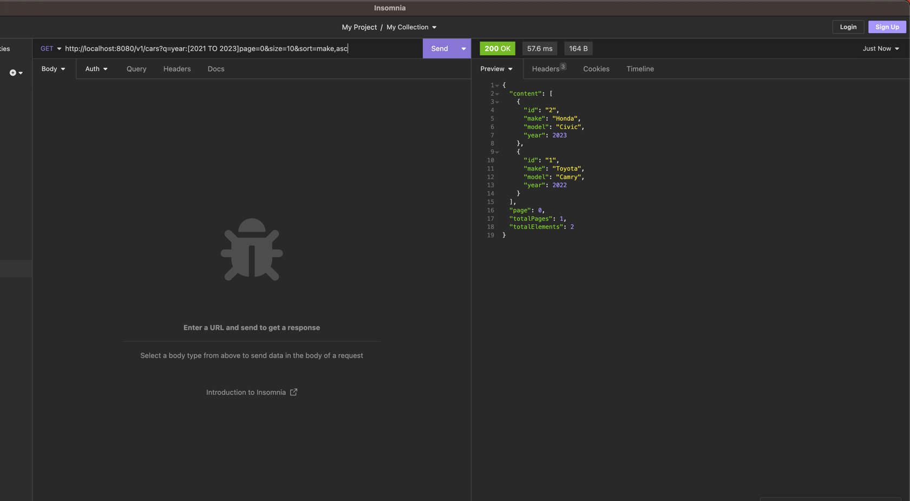

# Car Listings Microservice

The Car Listings Microservice is responsible for building and maintaining a searchable Elasticsearch projection of car
listings from an online marketplace. It consumes Kafka events produced by other services to stay in sync with the latest
car listing data. Users can search for car listings based on various criteria.

## Features

- **Event Consumer:**
    - Consumes Kafka events related to car listings (e.g., listing created, updated, deleted).
    - Updates the Elasticsearch projection to reflect the latest data.

- **Elasticsearch Projection:**
    - Indexes car listings with relevant information (make, model, year) in Elasticsearch.

- **Search Functionality:**
    - Implements Elasticsearch-based search for car listings by make, model, and year.
    - Returns relevant results based on user queries.

- **Additional Features (Optional):**
    - Pagination and sorting for search results.
    - Various search filters for refined queries by Lucene syntax.
    - Caching mechanisms for performance optimization.

## Technologies Used

- Java 17
- Spring Boot 3.1.2
- Spring Kafka
- Spring Data Elasticsearch
- Lombok 1.18.3
- Maven 3.8.6
- (Testing) TestContainer 1.18.3
## Project Structure
    MyCarListingApp
    ├── src
    │   ├── main
    │   │   ├── java
    │   │   │   ├── com
    │   │   │   │   ├── myapp
    │   │   │   │   │   ├── CarListingApplication.java
    │   │   │   │   │   ├── controller
    │   │   │   │   │   │   ├── CarController.java
    │   │   │   │   │   ├── service
    │   │   │   │   │   │   ├── CarService.java
    │   │   │   │   │   │   ├── impl
    │   │   │   │   │   |   |    ├── CarServiceImpl.java
    │   │   │   │   │   ├── model
    │   │   │   │   │   │   ├── Car.java
    │   │   │   │   │   │   ├── EventMessage.java
    │   │   │   │   │   ├── repository
    │   │   │   │   │   │   ├── CarRepository.java
    │   │   │   │   │   ├── listener
    │   │   │   │   │   │   ├── CarEventListener.java
    │   │   │   │   │   ├── dto
    │   │   │   │   │   │   ├── PageResponse.java
    │   ├── resources
    │   │   ├── application.yaml
    │   │   ├── logback.xml
    ├── target
    ├── sample-event-data
    ├── Dockerfile
    ├── docker-compose.yml
    ├── README.md

## Prerequisites

Before you begin, ensure you have the following installed:

1. Docker: [Install Docker](https://docs.docker.com/get-docker/)
2. (Optional if cannot install docker) Colima: [Install Colima](https://github.com/abiosoft/colima)
3. Docker-compose: [Install Docker Compose](https://docs.docker.com/compose/install/)
4. Java 17: [Install Java](https://www.oracle.com/java/technologies/javase/jdk17-archive-downloads.html)
5. Maven: [Install Maven](https://maven.apache.org/download.cgi)
6. Docker Need at least 4 CPU and 8GB RAM

## How to run

1. Check docker version**
   ```
    docker version
2. Build Application**
   ```
    mvn clean package -Dmaven.test.skip 
   
3. Run by docker-compose
   ```
    docker-compose up -d
4. Check services ready
   Run below command to ensure all services running correctly.
   ```
    docker-compose ps
 

## How to send event for sample data
1. [Download kafka client](https://kafka.apache.org/quickstart)
2. Unzip download client
3. Change directory to the unzipped folder
4. Run below command for created card event
   ```
    ./kafka-console-producer.sh --topic car-listings-topic --broker-list 0.0.0.0:29092 < {PROJECT_FOLDER}/sample-event-data/event_create_payload.txt
5. Run below command for updated card event
   ```
    ./kafka-console-producer.sh --topic car-listings-topic --broker-list 0.0.0.0:29092 < {PROJECT_FOLDER}/sample-event-data/event_update_payload.txt
6. Run below command for delete card event
   ```
    ./kafka-console-producer.sh --topic car-listings-topic --broker-list 0.0.0.0:29092 < {PROJECT_FOLDER}/sample-event-data/event_delete_payload.txt
   
## Accessing Your Application

After you have successfully set up and run your Spring Boot microservice using Docker,
you can interact with it using HTTP requests. Here are some sample `curl`
commands to demonstrate how to interact with the API endpoints:

# Search by make
    curl -X GET 'http://localhost:8080/v1/cars?q=make:Toyota' 
   
# Search by make and model
    curl -X GET 'http://localhost:8080/v1/cars?q=make:Toyota AND model:Corolla'

# Search by year range
    curl -X GET 'http://localhost:8080/v1/cars?q=year%3A%5B2020%20TO%202022%5D'

# Search with pagination and sorting
    curl -X GET 'http://localhost:8080/v1/cars?q=year%3A%5B2021%20TO%202023%5Dpage%3D0&size=10&sort=make,asc'


## How to run test

1. Check docker version
   ``` 
    docker version
2. (Optional) if you run docker by colima **
    ```
     export TESTCONTAINERS_DOCKER_SOCKET_OVERRIDE=/var/run/docker.sock 
     export DOCKER_HOST="unix://${HOME}/.colima/docker.sock"
3. ** Run Test **
    ```
     mvn clean test
